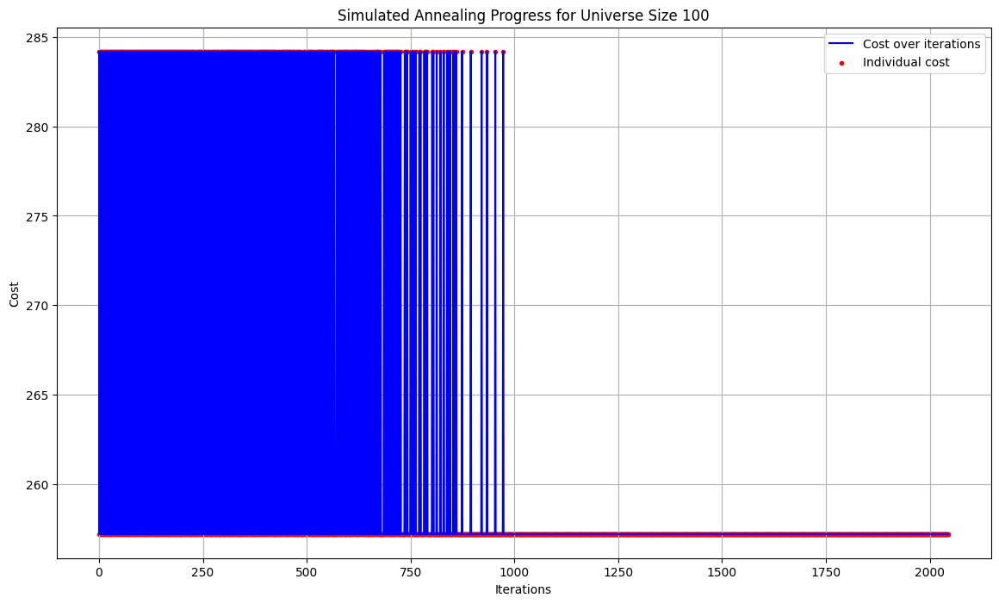
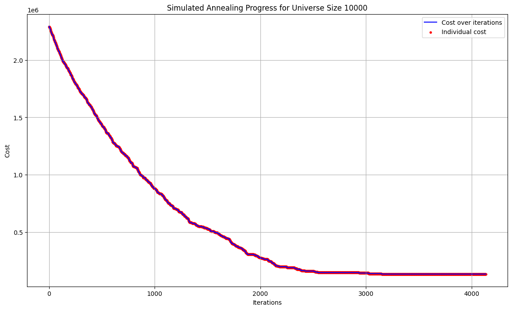
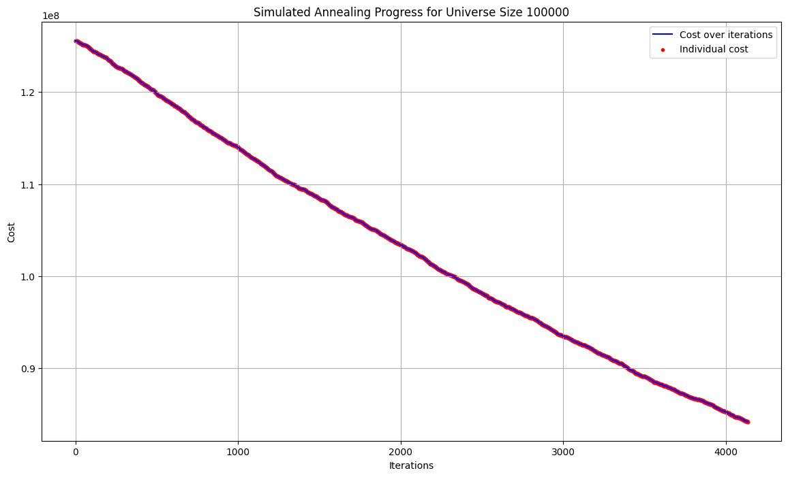
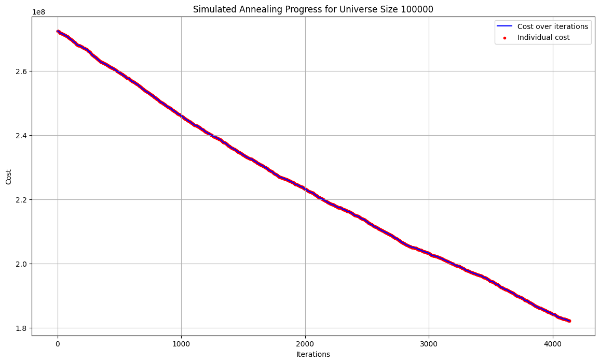
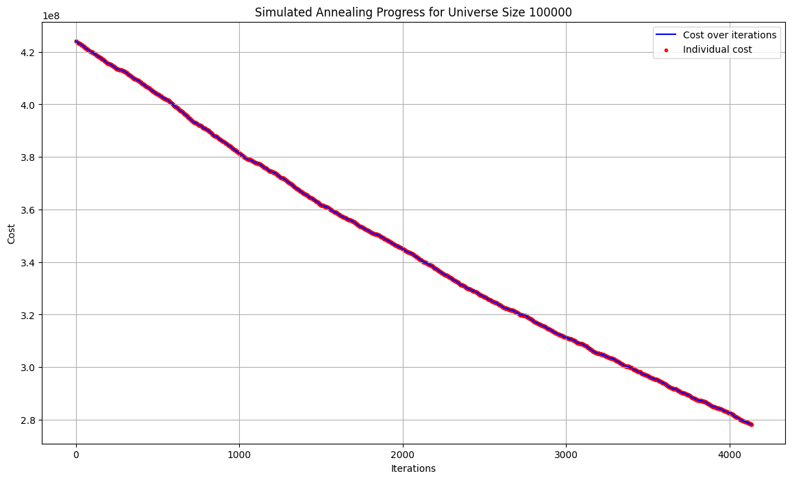

# CI2024_lab1

Computational Intelligence - Laboratory 1

In order to solve the set covering problem I have implemented a solution with a Simulated Annealing algorithm. These are the results with `initial_temp=1000.0, cooling_rate=0.995, min_temp=1e-6, max_iter=20_000`, perhaps it could be better decrease the min_temp stop condition in the last three cases, as to be able to observe the settlement of the cost function as the number of iterations increases.

## Universe size = 100, sets number = 10, density = 0.2

## Universe size = 1000, sets number = 100, density = 0.2

## Universe size = 10000, sets number = 1000, density = 0.2

## Universe size = 100000, sets number = 10000, density = 0.1

## Universe size = 100000, sets number = 10000, density = 0.2

## Universe size = 100000, sets number = 10000, density = 0.1

collaborators: 
Lampidecchia Sergio s331080 https://github.com/sergiolampidecchia, Brizzi Marialuigia 334148 https://github.com/Mars1601 

